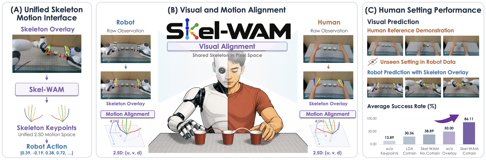
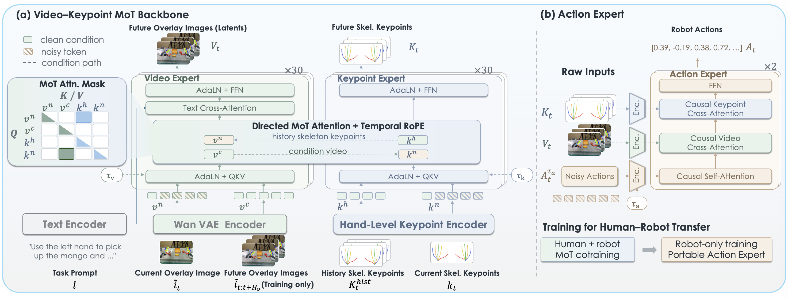

<h1 align="center">Skel-WAM: A Hand-Skeleton-Conditioned World Action Model for Human-to-Robot Manipulation Transfer</h1>

<p align="center">
<a href="https://healorcai.github.io/">Zetao Cai</a><sup>1,2</sup>, <a href="https://li-yaping.github.io/">Yaping Li</a><sup>1</sup>, <a href="https://22364yiqun.github.io/">Yiqun Wang</a><sup>2</sup>, <a href="https://scholar.google.com/citations?user=WurpqEMAAAAJ&amp;hl=en">Xinyu Zhan</a><sup>2</sup>, <a href="https://scholar.google.com/citations?user=0yB_bqEAAAAJ&amp;hl=en">Yuyin Yang</a><sup>2</sup>,<br>
<a href="https://mahaoxiang822.github.io/">Haoxiang Ma</a><sup>2</sup>, <a href="https://kailinli.top/">Kailin Li</a><sup>2</sup>, <a href="https://inspirelt.github.io/">Tao Lu</a><sup>2</sup>, <a href="https://oceanpang.github.io/">Jiangmiao Pang</a><sup>3</sup>, <a href="https://eveneveno.github.io/lnxu/">Linning Xu</a><sup>1,†</sup>, <a href="https://scholar.google.com/citations?user=GMzzRRUAAAAJ&amp;hl=en">Dahua Lin</a><sup>1,2,4,†</sup>
</p>

<p align="center">
<sup>1</sup>The Chinese University of Hong Kong &nbsp; <sup>2</sup>Shanghai AI Laboratory<br>
<sup>3</sup>Joy Future Academy &nbsp; <sup>4</sup>CPII under InnoHK<br>
<sup>†</sup>Corresponding authors
</p>

<h3 align="center">
<a href="https://arxiv.org/abs/2609.21514">📄 Paper</a> | <a href="https://healorcai.github.io/Skel-WAM/">🌐 Project Page</a> | <a href="https://www.youtube.com/watch?v=svhF2z4pJsM">🎬 Video</a>
</h3>

## 💡 TL;DR



**Skel-WAM transfers manipulation experience from humans to robots through a shared hand-skeleton interface**, combining scene-grounded skeleton overlays and structured 2.5-D keypoints to learn task variations absent from robot demonstrations.

## 🔍 Abstract

Robot demonstrations are expensive to collect and often provide limited distributional coverage of task variations. Human videos offer a low-cost source of complementary manipulation experience, but learning from them requires bridging embodiment gaps in visual appearance and action spaces. We introduce **Skel-WAM**, a world action model that bridges these differences through **a unified hand-skeleton motion interface**. The key insight is to align human and robot motion through a common hand topology, combining skeleton overlays that ground motion in the scene with structured 2.5-D keypoints that encode explicit hand kinematics. Video and Keypoint Experts jointly learn visual and skeletal dynamics through a Mixture-of-Transformers, while a separate robot-trained Action Expert maps these predictions to executable controls. This separation enables human and robot demonstrations to directly supervise shared dynamics without requiring robot action labels for human videos. Across four real-world bimanual tasks and seven simulated tasks, Skel-WAM achieves average success rates of **79.86%** and **63.29%**, surpassing the strongest baseline by 22.22 and 8.28 percentage points, respectively. Human–robot cotraining more than doubles real-world success on task variations absent from robot training data, from 38.89% to **86.11%**. These results demonstrate that **a shared skeletal interface enables joint learning across human and robot data and expands robot task coverage through complementary human demonstrations**.

## 🦾 Overview



- **Unified hand-skeleton interface.** Skeleton overlays ground motion in the scene, while structured 2.5-D keypoints encode explicit hand kinematics across human and robot embodiments.
- **Shared dynamics learning.** Video and Keypoint Experts jointly model visual and skeletal dynamics through a Mixture-of-Transformers trained on human and robot demonstrations.
- **Robot action prediction.** A separate Action Expert learns executable controls from robot data without propagating action gradients into the shared backbone.

## ✨ Highlights

| Evaluation setting | Average success rate |
| --- | ---: |
| Real-world manipulation · four bimanual tasks · robot-only training | **79.86%** |
| Real-world task variations absent from robot training data · human–robot cotraining | **86.11%** (vs. 38.89% without cotraining) |
| EgoVLA-Sim · seven tasks · robot-only training | **63.29%** |

See the [project page](https://healorcai.github.io/Skel-WAM/) for task videos, detailed results, and ablations.

## 📋 TODO

We will complete all releases listed below before December 2026.

- [ ] Release the evaluation code of Skel-WAM on EgoVLA-Sim experiments.
- [ ] Release the data processing pipeline, including robot/human hand skeleton overlay generation and skeleton keypoint extraction.
- [ ] Release the training code and checkpoints.

## 📚 Citation

If you find this work useful, please consider citing:

```bibtex
@misc{cai2026skelwam,
  title = {Skel-WAM: A Hand-Skeleton-Conditioned World Action Model for Human-to-Robot Manipulation Transfer},
  author = {Zetao Cai and Yaping Li and Yiqun Wang and Xinyu Zhan and Yuyin Yang and Haoxiang Ma and Kailin Li and Tao Lu and Jiangmiao Pang and Linning Xu and Dahua Lin},
  year = {2026},
  eprint = {2609.21514},
  archivePrefix = {arXiv},
  primaryClass = {cs.RO},
  url = {https://arxiv.org/abs/2609.21514},
}
```

## ⚖️ License

This repository is licensed under the [MIT License](LICENSE).
